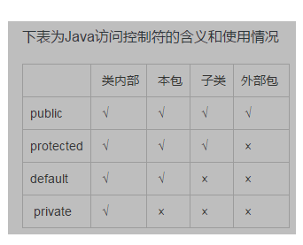

第 4 章 对 象 与 类

- 面向对象程序设计概述
- 使用预定义类
- 用户自定义类
- 静态域与静态方法
- 方法参数
- 对象构造
- 包
- 类路径
- 文档注释
- 类设计技巧

4.1- 面向对象程序设计概述:
 
 面向对象程序设计（简称 OOP) 是当今主流的程序设计范型， 它已经取代了 20 世纪 70年代的“ 结构化” 过程化程序设计开发技术。    

 面向对象的程序是由对象组成的， 每个对象包含对用户公开的特定功能部分和隐藏的实现部分。    
 
 程序中的很多对象来自标准库，还有一些是自定义的。究竟是自己构造对象， 还是从外界购买对象完全取决于开发项目的预算和时间。    
 
 但是， 从根本上说， 只要对象能够满足要求，就不必关心其功能的具体实现过程。在 OOP 中， 不必关心对象的具体实现，只要能
 够满足用户的需求即可。    
 
 传统的结构化程序设计通过设计一系列的过程（即算法）来求解问题。一旦确定了这些过程， 就要开始考虑存储数据的方式。  
 
 这就明确地表述了程序员的 X作方式。 t先要确定如何操作数据， 然后再决定如何组织数
 据， 以便于数据操作。 而 OOP 却调换了这个次序， 将数据放在第1位，然后再考虑操作数
 据的算法。    

        
对于一些规模较小的问题， 将其分解为过程的开发方式比较理想。而面向对象更加适用
于解决规模较大的问题。耍想实现一个简单的 Web 浏览器可能需要大约 2000 个过程，这些
过程可能需要对一组全局数据进行操作。采用面向对象的设计风格， 可能只需要大约 100 个
类，每个类平均包含 20 个方法（如图 4-丨所示。) 后者更易于程序员掌握， 也容易找到 bug

4 . 1.1 类

类（ class) 是构造对象的模板或蓝图。    我们可以将类想象成制作小甜饼的切割机，    将对象想象为小甜饼。
    
由类构造（construct) 对象的过程称为创建类的实例 （instance ).
    
封装（ encapsulation , 有时称为数据隐藏） 是与对象有关的一个重要概念。
从形式上看，封装不过是将数据和行为组合在一个包中， 并对对象的使用者隐藏了数据的实现方式。

对象中的数据称为实例域（ instance field ), 操纵数据的过程称为方法（ method 。) 对于每个特定的
类实例（对象）都有一组特定的实例域值。这些值的集合就是这个对象的当前状态（ state )。
    
无论何时，只要向对象发送一个消息，它的状态就有可能发生改变。
    
实现封装的关键在于绝对不能让类中的方法直接地访问其他类的实例域。程序仅通过对
象的方法与对象数据进行交互。封装给对象赋予了“ 黑盒” 特征， 这是提高重用性和可靠性
的关键。 这意味着一个类可以全面地改变存储数据的方式，只要仍旧使用同样的方法操作数据， 其他对象就不会知道或介意所发生的变化。
    
通过扩展一个类来建立另外一个类的过程称为继承（inheritance，
    

4 . 1.2 对 象  
•对象的行为（behavior)
—可以对对象施加哪些操作，或可以对对象施加哪些方法？    
•对象的状态（state )
—当施加那些方法时，对象如何响应？    
•对象标识（identity )
—如何辨别具有相同行为与状态的不同对象？    

4 . 1.3 识 别 类    
识别类的简单规则是在分析问题的过程中寻找名词，而方法对应着动词。

4.1.4 类之间的关系  
•依赖（dependence“ uses-a” 关系）  
•聚合（aggregation“ has-a”关系）  
•继承（inheritance“ is-a”关系）      

4.2 使用预定义类  
并不是所有的类都具有面向对象特征。例如，Math 类  
Math.random, 并只需要知道方法名和参数（如果有的话，) 而不必了解它的具体实现过程。这正是
封装的关键所在，当然所有类都是这样。但遗憾的是，Math 类只封装了功能，它不需要也不
必隐藏数据。由于没有数据，因此也不必担心生成对象以及初始化实例域：

4 . 2.1 对象与对象变量  
要想使用对象，就必须首先构造对象， 并指定其初始状态然后，Xt对象应用方法。在 Java 程序设计语言中， 使用构造器（constructor ) 构造新实例。

一个对象变量并没有实际包含一个对象，而仅仅引用一个对象  
在 Java 中，任何对象变量的值都是对存储在另外一个地方的一个对象的引用

4.2.2 Java 类库中的 LocalDate 类  
类库设计者决定将保存时间与给时间点命名分开。所以标准 Java 类库分别包含了两个类：
一个是用来表示时间点的 Date 类；另一个是用来表示大家熟悉的日历表示法的 LocalDate 类。

4.2.3 更改器方法与访问器方法-【LocalDate延申】        

4.3 用户自定义类~

4.3.1 Employee 类   
4.3.2 多个源文件的使用【在程序清单 4-2 中， 一个源文件包含了两个类】    
4.3.3 剖析 Employee 类   
4.3.4 从构造器开始  
构造器与其他的方法有一个重要的不同。构造器总是伴随着 new 操作符的执行被调用，
而不能对一个已经存在的对象调用构造器来达到重新设置实例域的目的。

4.3.5 隐式参数与显式参数  
隐式 （ implicit ) 参数是出现在方法名前的Employee 类对象  
第二个参数位于方法名后面括号中的数值，这是一个显式 （ explicit) 参数 （ 有些人把隐式参数称为方法调用的目标或接收者。)  

4 . 3.6 封装的优点（讲访问权限作用 私有成员变量 公开的get set方法）  
只返回实例域值， 因此又称为域访问器。  
只读域.一旦在构造器中设置完毕，就没有任何一个办法可以对它进行修改，这样来确保 name 域不会受到外界的破坏。  

4.3.7 基于类的访问权限(?)  
4.3.8 私有方法  

4.3.9 final 实例域  
可以将实例域定义为 final。 构建对象时必须初始化这样的域。  
在每一个构造器执行之后，这个域的值被设置， 并且在后面的操作中， 不能够再对它进行修改。  
final 修饰符大都应用于基本 （primitive ) 类型域，或不可变（immutable) 类的域        

4.4 静态域与静态方法

4 . 4.1 静态域  
如果将域定义为 static, 每个类中只有一个这样的域。而每一个对象对于所有的实例域却都有自己的一份拷贝。

4.4.2 静态常量  
4.4.3 静态方法【静态方法是一种不能向?象?施操作的方法】   
4.4.4 工厂方法【静态方法还有另外一种常见的用途。类似 LocalDate 和 NumberFormat 的类使用静态工厂方法 (factory methocO 来构造对象。】   

4.4.5 main 方法   
main 方法也是一个静态方法。   
main 方法不对任何对象进行操作。事实上，在启动程序时还没有任何一个对象。   
静态的main 方法将执行并创建程序所需要的对象。   
4.5 方法参数-  
 
4 . 6 对 象 构 造   

4.6.1 重载   
重载（ overloading。) 如果多个方法（比如， StringBuilder 构造器方法）有
相同的名字、 不同的参数，便产生了重载。编译器必须挑选出具体执行哪个方法，它通过用
各个方法给出的参数类型与特定方法调用所使用的值类型进行匹配来挑选出相应的方法。  

4.6.2 默认域初始化  
如果在构造器中没有显式地给域赋予初值，那么就会被自动地赋为默认值： 数值为 0、
布尔值为 false、 对象引用为 null。

4.6.3 无参数的构造器  
很多类都包含一个无参数的构造函数，对象由无参数构造函数创建时， 其状态会设置为适当的默认值。

4.6.4 显式域初始化(?)  
4 . 6.5 参数名（？）  
4.6.6 调用另一个构造器(？)  
关键字 this 引用方法的隐式参数。然而，这个关键字还有另外一个含义。
如果构造器的第一个语句形如 this(...)， 这个构造器将调用同一个类的另一个构造器。  

4.6.7 初始化块  
前面已经讲过两种初始化数据域的方法：  
•在构造器中设置值  
•在声明中赋值  
第三种机制， 称为初始化块（initialization block)。
无论使用哪个构造器构造对象，id 域都在对象初始化块中被初始化。首先运行初始化块，然后才运行构造器的主体部分。

4.6.8 对象析构与 finalize 方法  
(显式的析构器)?  
在析构器中， 最常见的操作是回收分配给对象的存储空间。由于 Java 有自动的垃圾回收器，不需要人工回收内存， 所以 Java 不支持析构器。  
某些对象使用了内存之外的其他资源， 例如，文件或使用了系统资源的另一个对象的句柄。在这种情况下，当资源不再需要时， 将其回收和再利用将显得十分重要。  

4.7包  
Java 允许使用包（ package > 将类组织起来。借助于包可以方便地组织自己的代码，并将自己的代码与别人提供的代码库分开管理。  
标准的 Java包具有一个层次结构。如同硬盘的目录嵌套一样，也可以使用嵌套层次组织包。使用包的主要原因是确保类名的唯一性。  

4.7.1 类的导入  
一个类可以使用所属包中的所有类， 以及其他包中的公有类（ public class。) 我们可以采用两种方式访问另一个包中的公有类。  
第1种方式是在每个类名之前添加完整的包名。   
java.tiie.LocalDate today = java.tine.Local Date.now();  
第2种使用 import 语句。import 语句是一种引用包含在包中的类的简明描述。  

4 . 7.2 静态导入  
import 语句不仅可以导人类，还增加了导人静态方法和静态域的功能。  
import static java.lang.System.*;  

4 . 7.3 将类放入包中~  
4.7.4 包作用域~  
4.8 类路径~   
4.8.1 设置类路径~  
4.9 文档注释（javadoc）
4.9.1 注释的插入  
4.9.2 类注释  
4.9.3 方法注释  
4.9.4 域注释  
4.9.6 包与概述注释  
4.9.7 注释的抽取  
======================  
@param 变量描述  
@return 返回描述  
@throws 异常描述  
@author  
@version 版本描述  
@sine  
@deprecated   
@see   
======================  
4.10 类设计技巧  
1.一定要保证数据私有  
2.一定要对数据初始化  
3.不要在类中使用过多的基本类型  
4.不是所有的域都需要独立的域访问器和域更改器  
5.将职责过多的类进行分解  
6.类名和方法名要能够体现它们的职责  
7.优先使用不可变的类  
        
第 5章 继 承

5.1 类、超类和子类  
5.1.1 定义子类  
5.1.2 覆盖方法  
5.1.3 子类构造器(?)  
隐式参数-【https://blog.csdn.net/zsk1196468672/article/details/51628145】  

5.1.4   继承层次（ inheritance hierarchy )  
  

5 . 1.5  多 态  
(如果超类 创建 子类 实例 在底层中属于什么？)  

5.1.6   理解方法调用  
 重 栽 解 析 （ overloading resolution)
 静 态 绑 定（static binding )
 动态绑定？  
略过 内容超纲-  

5.1.7   阻 止 继 承： final 类 和 方 法  
避免动态绑定带来的系统开销而使用 final 关键字。 如果一个方法没有被覆盖并且很短， 编译器就能够对它进行优化处理， 这个过程为称为内联 ( inlining )。  

5.1.8   强制类型转换  
进行类型转换的唯一原因是： 在暂时忽视对象的实际类型之后， 使用对象的全部功能。
~（sleep lack weary）

5 . 1.9   抽 象 类  
抽象方法充当着占位的角色， 它们的具体实现在子类中。 扩展抽象类可以有两种选择。 一种是在抽象类中定义部分抽象类方法或不定义抽象类方法， 这样就必须将子类也标记为抽 象类；另一种是定义全部的抽象方法， 这样一来， 子类就不是抽象的了。  
  -网站摘录  
抽象类除了不能实例化对象之外，类的其它功能依然存在，成员变量、成员方法和构造方法的访问方式和普通类一样。  
由于抽象类不能实例化对象，所以抽象类必须被继承，才能被使用。也是因为这个原因，通常在设计阶段决定要不要设计抽象类。    
抽象方法的 3 个特征如下：  
抽象方法没有方法体  
抽象方法必须存在于抽象类中  
子类重写父类时，必须重写父类所有的抽象方法  

5.1.10   受保护访问    
    

5.2Object： 所有类的超类  
Object 类是  Java 中所有类的始祖， 在  Java 中每个类都是由它扩展而来的.如果没有明确地指出超类， Object 就被认为是这个类的超类。 所有的数组类塱， 不管是对象数组还是基本类型的数组都扩展了  Object 类。  

5.2.1   equals 方法  
Object 类中的 equals 方法用于检测一个对象是否等于另外一个对象。 在 Object 类中， 这 个方法将判断两个对象是否具有相同的引用。 如果两个对象具有相同的引用， 它们一定是相 等的。 从这点上看， 将其作为默认操作也是合乎情理的。 然而， 对于多数类来说， 这种判断 并没有什么意义。  
-简单讲object的equals 需要重写 自己和自己比没有意义[见POS 重写方法]  

5.2.2   相等测试与继承(繁杂-略)  

5.2.3  hashCode 方法  
[https://www.cnblogs.com/whgk/p/6071617.html]  
[介绍 散列表 https://www.cnblogs.com/yelongsan/p/8340047.html]  
[散列表的核心优势是能够按照关键字快速存取数据记录，其插入、查找和删除的平均时间复杂度为O(1)。]    
散 列 码 （ hash code ) 是由对象导出的一个整型值。 散列码是没有规律的。    
hashcode就是通过hash函数得来的，通俗的说，就是通过某一种算法得到的，hashcode就是在hash表中有对应的位置。    
首先一个对象肯定有物理地址，在别的博文中会hashcode说成是代表对象的地址，这里肯定会让读者形成误区，对象的物理地址跟这个hashcode地址不一样，hashcode代表对象的地址说的是对象在hash表中的位置，物理地址说的对象存放在内存中的地址，那么对象如何得到hashcode呢？通过对象的内部地址(也就是物理地址)转换成一个整数，然后该整数通过hash函数的算法就得到了hashcode，所以，hashcode是什么呢？就是在hash表中对应的位置。    

以 java.lang.Object来理解,JVM每new一个Object,它都会将这个Object丢到一个Hash哈希表中去,这样的话,下次做 Object的比較或者取这个对象的时候,它会依据对象的hashcode再从Hash表中取这个对象。这样做的目的是提高取对象的效率。    

5.2.4   toString 方法  
在  Object 中还有一个重要的方法，  就是 toString 方法， 它用于返回表示对象值的字符 串

5.3   泛 型 数 组 列 表[https://www.cnblogs.com/caiba/p/10579870.html]    
-网站摘录  
泛型的引入主要是为了解决两个方面的问题：1.集合类型元素在运行期出现类型装换异常，增加编译时类型的检查，2. 解决的时重复代码的编写，能够复用算法    
泛型的概念，及类型的参数化。java中的泛型是在jdk5.0后出现的，但是java中的泛型与C#中的泛型是有本质区别的，首先从集合类型上来说，    
java 中的ArrayList<Integer>和ArrayList<String>是同一个类型，在编译时会执行类型擦除，及java中的类型是伪泛型，伪泛型将会在后面介绍，其次，对于像集合中添加基本类型的数据时，    
例如int，会首先将int转化成Integer对象，即我们通常所说的装箱操作，在取出元素的时候需要将Interger对象转换成int值类型，即拆箱操作。    
而在c#中，List<int>和List<string>是不同的类型，泛型参数在编译后会是一个占位符，并没有被擦除，在运行时被赋予正真的类型，它们在系统运行期生成，有自己的虚方法表和类型数据，这种实现称为类型膨胀（针对类型膨胀，即时编译器已经做了很多的优化工作来解决这一问题），这就是所谓的真泛型。与此同时，在对集合中添加基本元素如int时，不需要装箱操作，取出元素时不需要拆箱操作，因此，性能上较java的集合泛型要好。    

-本书摘录  
emm 讲了下动态数组的优点和实现过程.  

5.3.1   访问数组列表元素  
5.3.2   类型化与原始数组列表的兼容性~  

5.4   对象包装器与自动装箱  
有时， 需要将 int 这样的基本类型转换为对象。 所有的基本类型都冇一个与之对应的类。 例如，Integer 类对应基本类型 int 通常， 这 些 类 称 为 包 装 器 （ wrapper ) 

5.5   参数数量可变的方法  
public static double max (double... values){..}  
double m  = max(3.1, 40.4, -5);  

5.6   枚举类[https://blog.csdn.net/qq_27093465/article/details/52180865]       

5.7反射   
能够分析类能力的程序称为反射 （ reflective)。    
反射库 （ reflection library) 提供了一个非常丰富且精心设计的工具集， 以便编写能够动 态操纵 Java 代码的程序。    
在设计或运行中添加新类时， 能够快速地应用开发工具动态地查询新添 加类的能力。    

•在运行时分析类的能力。  
•在运行时查看对象， 例如， 编写一个  toString 方法供所有类使用。  
•实现通用的数组操作代码。  
•利用 Method 对象， 这个对象很像中的函数指针。  

5.7.1   Class 类    
【https://blog.csdn.net/sinat_38259539/article/details/71799078】  
【】
程序运行期间，Java 运行时系统始终为所有的对象维护一个被称为运行时的类型标识。 这个信息跟踪着每个对象所属的类。 虚拟机利用运行时类型信息选择相应的方法执行    
过专门的  Java 类访问这些信息。 保存这些信息的类被称为 Class  

5.7.2   捕 获 异 常  
当程序运行过程中发生错误时， 就会“  抛出异常抛出异常比终止程序要灵活得多，” 异常 的 处 理 器 （handler) 对异常情况进行处理，这是因为可以提供一个“ 捕获    
如果没有提供处理器， 程序就会终止， 并在控制台上打印出一条信息， 其中给出了异常的 类型    
异常有两种类型： 未检查异常和已检查异常。 对于已检查异常， 编译器将会检查是否提 供了处理器。 然而， 有很多常见的异常， 例如， 访问 null 引用， 都属于未检查异常。    

5.7.3  利用反射分析类的能力  
反射机制最重要的内容——检查类的结构。    
reflect 包中有三个类 Field、 Method 和 Constructor 分别用于描述类的域、 方 法和构造器。  

5.7.4   在运行时使用反射分析对象   
域 对象域 数据域?  

5.7.5   使用反射编写泛型数组代码~  

5.7.6   调 用 任 意 方 法  
[https://www.cnblogs.com/qingchen521/p/8575761.html]  
Method的invoke方法能调用任意方法  

5.8   继承的设计技巧  
1.将公共操作和域放在超类
2.不要使用受保护的域
3.使 用 继 承 实 现“  is-a” 关 系
4.除 非 所 有 继 承 的 方 法 都 有 意 义， 否 则 不 要 使 用 继 承   
5.在覆盖方法时， 不要改变预期的行为  
6.使用多态，而非类型信息  
7.不要过多地使用反射  

